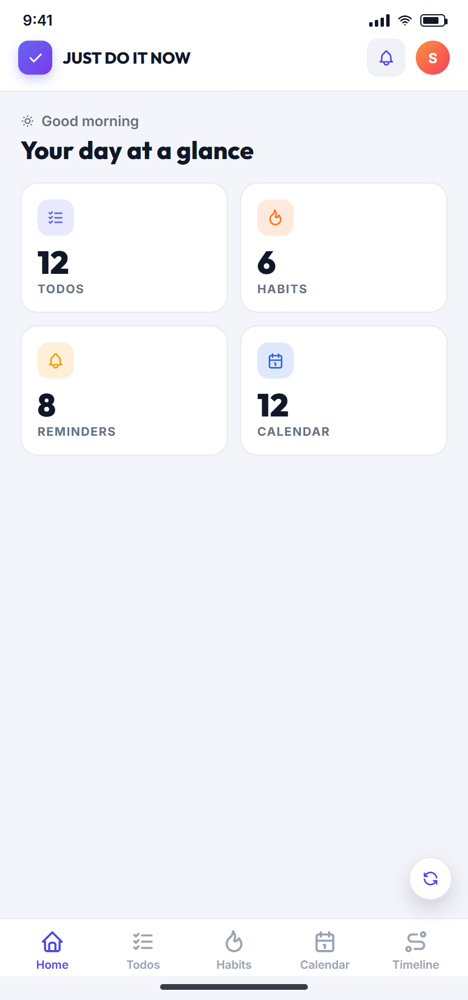
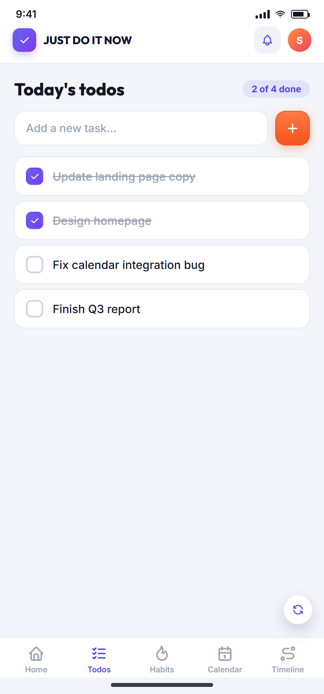
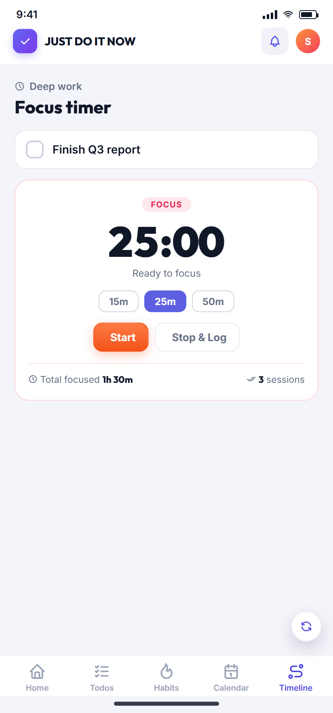
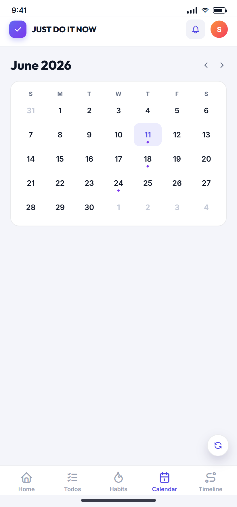

<div align="center">


# JUST DO IT NOW

**A self-hosted to-do, habit & project tracker you own end to end.**

Tasks, projects, habits, a calendar and focus mode — in one installable web app,
backed by a single [PocketBase](https://pocketbase.io) binary. Deploy a whole
container on Proxmox with **one command**, or run it on any Debian box.


</div>

---

## ✨ Features

- ✅ **Tasks** — priorities, due dates & times, projects, attachments, comments
- 📁 **Projects** — progress tracking, statuses, per-project task views
- 🔁 **Habits** — daily check-ins, streaks, and "starts soon" reminder emails
- 📅 **Calendar** & 🎯 **Focus mode** to plan and get heads-down
- 📧 **Weekly email report** — a Sunday summary of what you got done
- 🔐 **Two-factor authentication** — authenticator-app (TOTP) codes: iPhone
  Passwords, Microsoft Authenticator, Duo, Google Authenticator, Authy…
- 📱 **Installable PWA** — add it to your phone or desktop home screen
- 🌗 **Dark mode & themes**
- 🏠 **Truly self-hosted** — one PocketBase process serves the app *and* its API;
  no Docker, no reverse proxy, no external services required

## 📸 Screenshots

| Dashboard | Tasks | Focus | Calendar |
|---|---|---|---|
|  |  |  |  |

## 🚀 Install

### Option A — Proxmox VE (one command)

Run this in your **Proxmox host shell**. It creates a dedicated LXC container
(with the storage wizard and its own IP) and installs everything:

```bash
bash -c "$(curl -fsSL https://raw.githubusercontent.com/SLjuste-IT/just-do-it-now/main/proxmox/install-lxc.sh)"
```

At the end it prints the URL and a first-login you'll be prompted to change:

```
Open the app:  http://<container-ip>:8080/
First login:   admin@localhost.com
Password:      <shown here>
```

### Option B — any Debian / Ubuntu box (LXC, VM, TrueNAS, bare metal)

Run **inside** a fresh Debian 12/13 container or VM:

```bash
bash -c "$(curl -fsSL https://raw.githubusercontent.com/SLjuste-IT/just-do-it-now/main/proxmox/quick-install.sh)"
```

Either way, re-run the same command any time to **update**.

> Requires ~1 vCPU / 512 MB RAM / 3 GB disk. Everything lives in
> `/opt/just-do-it-now/pb_data` — that folder is the only thing to back up.

## 🔑 First run

1. Open the app and sign in with the **`admin@localhost.com`** credentials the
   installer printed.
2. You'll immediately be asked to set **your own email and password** — done.
3. (Optional) turn on **two-factor** under **Settings → Account → Two-Factor
   Authentication** — scan the QR with your phone and save the backup codes.

No email server is needed to sign in — accounts work offline out of the box.

## 📮 Optional: email (reminders, weekly reports & email 2FA)

The weekly report, habit reminders, and email-based verification need an SMTP
server. To enable it, reveal the admin dashboard once inside the container:

```bash
systemctl set-environment SHOW_ADMIN=1 && systemctl restart just-do-it-now
```

Then open `http://<ip>:8080/_/`, create a superuser, and set your SMTP under
**Settings → Mail**. Hide the dashboard again afterward:

```bash
systemctl unset-environment SHOW_ADMIN && systemctl restart just-do-it-now
```

See [`proxmox/README.md`](proxmox/README.md) for details and for enabling
email-code 2FA.

## 🔒 Security notes

- End-users only ever reach the app (`/`); the PocketBase dashboard (`/_/`) is
  hidden by default on self-hosted installs.
- Every user can read and write **only their own data** (owner-scoped rules).
- Two-factor secrets and backup codes are stored hidden and never leave the
  server; login is rate-limited against brute force.
- Found a vulnerability? Please report it privately — see
  [SECURITY.md](SECURITY.md).

## 🛠️ Tech stack

- **Frontend:** a single `index.html` — vanilla JS + Tailwind, PWA (service worker)
- **Backend:** [PocketBase](https://pocketbase.io) (one Go binary: SQLite, auth,
  REST API, file storage), extended with JS hooks in `pb_hooks/`
- **Schema:** auto-applied migrations in `pb_migrations/`
- **Deploy:** native LXC install scripts in `proxmox/` (targeting
  [Proxmox VE Helper-Scripts](https://community-scripts.org))

## 🤝 Contributing

Issues and pull requests are welcome. This project is heading toward a listing
on [community-scripts.org](https://community-scripts.org); the scripts under
`proxmox/` follow their conventions.

## 📄 License

Released under the [MIT License](LICENSE) — free to use, self-host, and modify.
